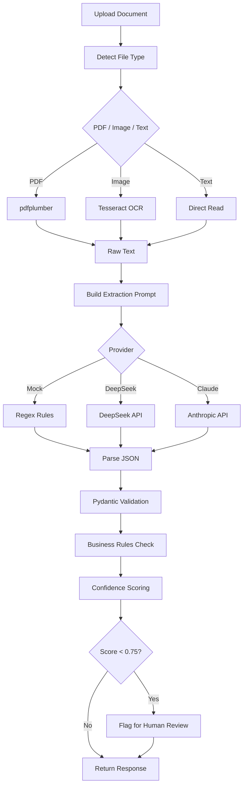

# VLM Document Extraction API

Production-style Document AI API for extracting structured data from PDFs/images using OCR + LLM/VLM pipelines.

## Why This Project Matters

Most AI portfolios show chatbots and RAG demos. This project demonstrates **Document AI engineering** — a high-demand skill in enterprise: processing invoices, receipts, and forms at scale with structured output, validation, confidence scoring, and human-review flagging.

## Architecture



## Features

- **Multi-format input** — PDF, PNG, JPG, TXT file upload + raw text endpoint
- **Provider system** — Mock (default, no API key), DeepSeek, Claude — pluggable
- **Pydantic v2 schemas** — Strict structured extraction with type validation
- **Business rules** — total = subtotal + tax, line item math, date ordering
- **Confidence scoring** — Field-level + aggregate, auto human-review flagging
- **Evaluation endpoint** — Compare extraction against ground truth
- **Docker-ready** — Single command deploy

## Tech Stack

| Layer | Technology |
|-------|-----------|
| API Framework | FastAPI + Uvicorn |
| Validation | Pydantic v2 |
| PDF Parsing | pdfplumber |
| OCR | pytesseract (optional) |
| LLM Providers | DeepSeek / Claude / Mock |
| HTTP Client | httpx |
| Testing | pytest |
| Container | Docker |

## API Endpoints

| Method | Path | Description |
|--------|------|-------------|
| GET | `/health` | Service status, version, provider |
| POST | `/v1/extract` | Upload file → structured extraction |
| POST | `/v1/extract/text` | Raw text → structured extraction |
| POST | `/v1/evaluate` | Run eval against ground truth |

### Example: Extract from text

```bash
curl -X POST http://localhost:8000/v1/extract/text \
  -H "Content-Type: application/json" \
  -d '{
    "text": "Invoice #: INV-2026-0847\nDate: 2026-06-15\nFrom: TechVision Solutions Ltd.\nBill To: GlobalTrade Corp.\nSubtotal: $14,500.00\nTax (10%): $1,450.00\nTotal Amount: $15,950.00\nPayment Terms: Net 30\nDue Date: 2026-07-15",
    "document_type": "invoice",
    "provider": "mock"
  }'
```

### Example Response

```json
{
  "document_id": "a1b2c3d4e5f6",
  "document_type": "invoice",
  "extracted_fields": {
    "invoice_number": "INV-2026-0847",
    "invoice_date": "2026-06-15",
    "seller_name": "TechVision Solutions Ltd.",
    "buyer_name": "GlobalTrade Corp.",
    "currency": "USD",
    "subtotal": 14500.0,
    "tax": 1450.0,
    "total_amount": 15950.0,
    "line_items": [],
    "payment_terms": "Net 30",
    "due_date": "2026-07-15"
  },
  "confidence_score": 0.92,
  "field_confidences": {
    "invoice_number": 1.0,
    "invoice_date": 1.0,
    "seller_name": 1.0,
    "buyer_name": 1.0,
    "total_amount": 1.0,
    "currency": 1.0,
    "line_items": 0.0,
    "subtotal": 1.0,
    "tax": 1.0,
    "payment_terms": 1.0,
    "due_date": 1.0
  },
  "validation_errors": [],
  "requires_human_review": false,
  "warnings": [],
  "processing_time_ms": 85.3,
  "provider_used": "mock",
  "raw_text_preview": "Invoice #: INV-2026-0847..."
}
```

## Quick Start

```bash
git clone https://github.com/Boothill2001/vlm-document-extraction-api.git
cd vlm-document-extraction-api
pip install -r requirements.txt

# Run server (mock provider — no API key needed)
uvicorn app.main:app --reload

# Open Swagger UI
# http://localhost:8000/docs

# Run evaluation
python scripts/run_eval.py

# Run tests
pytest tests/ -v
```

### Docker

```bash
docker compose up --build
# API at http://localhost:8000/docs
```

## Environment Variables

| Variable | Default | Description |
|----------|---------|-------------|
| `DEFAULT_PROVIDER` | `mock` | Default extraction provider |
| `DEEPSEEK_API_KEY` | — | DeepSeek API key (optional) |
| `CLAUDE_API_KEY` | — | Anthropic API key (optional) |
| `LOG_LEVEL` | `INFO` | Logging level |
| `MAX_FILE_SIZE_MB` | `10` | Max upload file size |

## Confidence Scoring

| Condition | Penalty |
|-----------|---------|
| Missing required field | -0.10 per field |
| Empty line_items | -0.08 |
| Validation error | -0.05 per error |
| **Human review threshold** | **< 0.75** |

Required fields: `invoice_number`, `invoice_date`, `seller_name`, `buyer_name`, `total_amount`, `currency`

## Production Considerations

If deploying to production, consider:

- **Rate limiting** — API gateway with per-client throttling
- **Async queue** — Celery/RQ for heavy OCR + LLM processing
- **Database** — PostgreSQL for extraction logs, audit trail
- **Object storage** — S3/GCS for uploaded documents
- **Observability** — OpenTelemetry + Grafana for latency/error monitoring
- **Provider fallback** — Auto-switch provider on failure/timeout
- **Privacy/Security** — Encrypt PII fields, auto-delete uploads, SOC2
- **Human review workflow** — Queue low-confidence results for manual review

## Related Projects

Part of a GenAI portfolio:

1. **[Advanced RAG](https://github.com/Boothill2001/RAG_project)** — Hybrid search + re-ranking
2. **[Research Copilot](https://github.com/Boothill2001/AI_AGENT_LANGGHAPH)** — LangGraph agent + MCP
3. **[Enterprise RAG Assistant](https://github.com/Boothill2001/Enterprise_RAG_Assistant)** — RBAC, tool calling, eval harness
4. **[Chunking Strategies](https://github.com/Boothill2001/rag-chunking-strategies)** — Chunking impact on retrieval
5. **[Agentic Tool Calling](https://github.com/Boothill2001/agentic-tool-calling-demo)** — Structured tool calling + human approval
6. **[RAG Monitoring](https://github.com/Boothill2001/rag-monitoring-evaluation-dashboard)** — Observability, evaluation, failure analysis
7. **VLM Document Extraction** (this repo) — Document AI, OCR, structured extraction

## Author

**Nguyen Minh Tri** — Senior AI Engineer

- Email: minhtri.cm2001@gmail.com
- [GitHub](https://github.com/Boothill2001)
